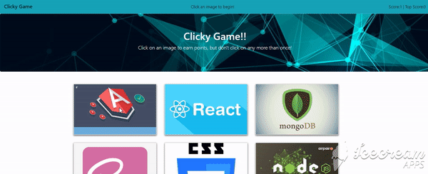

# Clicky-Game
Its a memory game with React. The application dynamically reads all images from Assets folder and displays as card. On click of each image, score will be calculated. The user's score is incremented when clicking an image for the first time. The user's score is reset to 0 if they click the same image more than once.
Here are some of the highlights:
- Uses create-react-app to generate the react application
- Has modularised components
- All images are dynamically read from Assets folder
- Logic for shuffling of images are written each time user selects an image
- Score are incremented on each correct guess and reset to zero if not answered corectly
- Top score are calculated comparing each scores and calculating maximum of it.


```
Here is how the application works:
```



## Prerequisites

- git clone https://github.com/shambhawi13/Clicky-Game.git
- navigate to folder where you cloned the application
- RUN npm start
- OR to play the game visit the Live site.

## Technologies Used
- JavaScript - Core logic
- React
- Bootstrap
- css
- Git - version control system to track changes to source code
- GitHub - hosts repository that can be deployed to GitHub Pages

## Installing

- Clone the repository : git clone https://github.com/shambhawi13/Clicky-Game.git 

## Authors

* **Shambhawi Kumari**
 [GitHub](https://github.com/shambhawi13/) | 
 [LinkedIn](https://www.linkedin.com/in/shambhawi-kumari/)


## Review URL

[GitHub](https://github.com/shambhawi13/Clicky-Game) | 
[Live](https://shambhawi13.github.io/Clicky-Game/)


